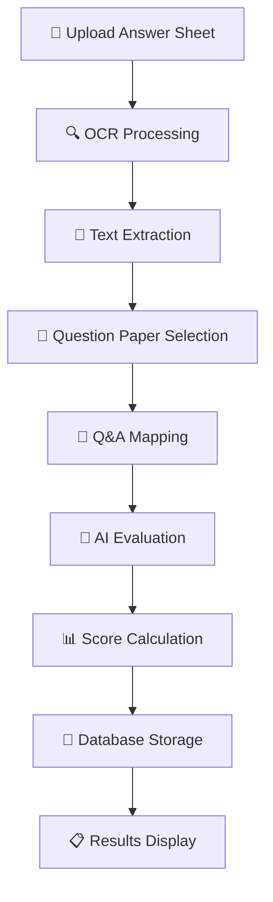
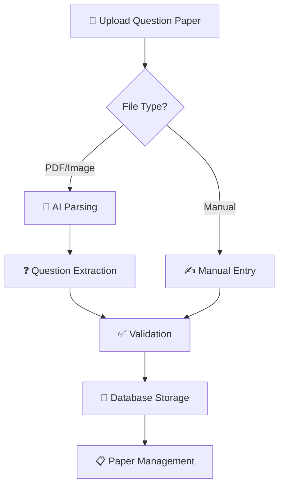

# AI Evaluation App - Project Structure & Documentation

## 🎯 **Project Overview**

The **AI Evaluation App** is a comprehensive educational technology platform that automates the evaluation of student answer sheets using advanced AI technologies. It combines OCR (Optical Character Recognition), intelligent question-answer mapping, and AI-powered assessment to provide detailed feedback and grading for academic submissions.

---

## 🏗️ **Project Architecture**

```
AI_Evaluation_APP/
├── 📁 frontend/                     # React TypeScript Frontend
│   ├── 📁 src/
│   │   ├── 📁 components/           # Reusable UI components
│   │   ├── 📁 features/             # Feature-based modules
│   │   ├── 📁 pages/                # Application pages
│   │   ├── 📁 hooks/                # Custom React hooks
│   │   └── 📁 lib/                  # Utility functions
│   ├── 📄 package.json              # Frontend dependencies
│   ├── 📄 vite.config.ts            # Vite configuration
│   └── 📄 tailwind.config.ts        # Tailwind CSS config
│
├── 📁 backend/                      # FastAPI Python Backend
│   ├── 📁 routes/                   # API endpoint handlers
│   │   ├── 📄 auth_routes.py        # Authentication endpoints
│   │   ├── 📄 evaluation_routes.py  # AI evaluation endpoints
│   │   ├── 📄 ocr_routes.py         # OCR processing endpoints
│   │   ├── 📄 mapping_routes.py     # Q&A mapping endpoints
│   │   ├── 📄 question_paper_routes.py # Question paper management
│   │   ├── 📄 pipeline_routes.py    # Complete processing pipeline
│   │   └── 📄 analytics_routes.py   # Analytics & reporting
│   │
│   ├── 📁 evaluation/               # AI evaluation engine
│   │   └── 📄 evaluator.py          # Gemini AI evaluation logic
│   │
│   ├── 📁 ocr/                      # OCR processing module
│   │   └── 📄 ocr_processor.py      # Document text extraction
│   │
│   ├── 📁 qna_mapping/              # Question-Answer mapping
│   │   └── 📄 mapper.py             # AI-powered Q&A mapping
│   │
│   ├── 📁 question_paper/           # Question paper parsing
│   │   └── 📄 parser.py             # AI question paper parser
│   │
│   ├── 📁 mongoDB/                  # Database layer
│   │   ├── 📄 db_config.py          # MongoDB connection
│   │   ├── 📄 models.py             # Database models/schemas
│   │   └── 📄 auth.py               # Authentication logic
│   │
│   ├── 📁 models/                   # Pydantic request/response models
│   │   └── 📄 schemas.py            # API data schemas
│   │
│   ├── 📄 main.py                   # FastAPI application entry
│   ├── 📄 config.py                 # Configuration management
│   ├── 📄 prompts.py                # AI prompts for various tasks
│   └── 📄 requirements.txt          # Python dependencies
│
├── 📄 env-template.txt              # Environment variables template
└── 📄 README.md                     # Project documentation
```

---

## 🚀 **MVP (Minimum Viable Product) Features**

### **Core Features**

#### 1. **AI-Powered Evaluation System**
- ✅ **Rubric-Based Assessment**: Structured evaluation using predefined criteria
- ✅ **Multi-Criteria Scoring**: Accuracy, Completeness, Clarity, and Depth analysis
- ✅ **Intelligent Feedback**: Detailed AI-generated feedback for each answer
- ✅ **Grade Calculation**: Automatic grade assignment (A+, A, B, C, D, F)
- ✅ **Performance Analytics**: Comprehensive scoring with percentage calculations

#### 2. **Document Processing Pipeline**
- ✅ **OCR Processing**: Extract text from PDF/image answer sheets
- ✅ **Question-Answer Mapping**: AI-powered identification of Q&A pairs
- ✅ **Multi-Format Support**: PDF, PNG, JPG, JPEG, TIFF, BMP files
- ✅ **Batch Processing**: Handle multiple pages and documents
- ✅ **Text Validation**: Quality checks for extracted content

#### 3. **Question Paper Management**
- ✅ **Manual Creation**: Create question papers with custom questions
- ✅ **AI PDF Parsing**: Extract questions from PDF/image question papers
- ✅ **Question Validation**: Automatic validation of parsed questions
- ✅ **CRUD Operations**: Create, read, update, delete question papers
- ✅ **Search & Filter**: Find question papers by title, subject, topic

#### 4. **Assessment Management**
- ✅ **Evaluation History**: View all completed assessments
- ✅ **Detailed Reports**: Comprehensive evaluation breakdowns
- ✅ **Performance Tracking**: Monitor student progress over time
- ✅ **Export Functionality**: Download reports in markdown format
- ✅ **Filter & Sort**: Organize assessments by various criteria

#### 5. **User Interface & Experience**
- ✅ **Modern Dashboard**: Clean, intuitive interface design
- ✅ **Responsive Design**: Works on desktop, tablet, and mobile
- ✅ **Real-time Processing**: Live updates during evaluation
- ✅ **Progress Indicators**: Visual feedback for long-running operations
- ✅ **Error Handling**: User-friendly error messages and recovery

### **Advanced Features**

#### 6. **Analytics & Insights**
- ✅ **Performance Metrics**: Detailed statistical analysis
- ✅ **Trend Analysis**: Track improvement over time
- ✅ **Comparative Reports**: Benchmark against standards
- ✅ **Data Visualization**: Charts and graphs for insights

#### 7. **Complete Processing Pipeline**
- ✅ **One-Click Evaluation**: OCR → Mapping → Evaluation in single operation
- ✅ **Workflow Automation**: Streamlined processing with minimal user input
- ✅ **Error Recovery**: Robust handling of processing failures
- ✅ **Status Tracking**: Real-time progress monitoring

---

## 🛠️ **Technology Stack**

### **Frontend Technologies**
- **⚛️ React 18**: Modern UI library with hooks and functional components
- **📘 TypeScript**: Type-safe JavaScript for better development experience
- **⚡ Vite**: Fast build tool and development server
- **🎨 Tailwind CSS**: Utility-first CSS framework for styling
- **🧭 React Router**: Client-side routing and navigation
- **📡 Axios**: HTTP client for API communication
- **🔧 React Hook Form**: Form handling and validation
- **📊 Recharts**: Data visualization and charting library
- **💎 Radix UI**: Accessible, unstyled UI components
- **🎯 Lucide React**: Beautiful SVG icons

### **Backend Technologies**
- **🐍 Python 3.11+**: Modern Python with async support
- **⚡ FastAPI**: High-performance async web framework
- **🤖 Google Gemini AI**: Advanced language model for evaluation and parsing
- **🗄️ MongoDB**: NoSQL database for flexible data storage
- **🔧 Pydantic**: Data validation and serialization
- **📄 pdf2image**: PDF to image conversion for OCR
- **🖼️ Pillow (PIL)**: Image processing and manipulation
- **🔄 Tenacity**: Retry logic for API calls
- **📝 Python-dotenv**: Environment variable management
- **🔐 PyJWT**: JSON Web Token authentication

### **AI & Machine Learning**
- **🧠 Google Gemini 2.5 Flash**: Core AI model for:
  - Text evaluation and scoring
  - Question paper parsing
  - OCR text extraction
  - Question-answer mapping
- **📖 Natural Language Processing**: Advanced text analysis
- **🎯 Prompt Engineering**: Optimized AI prompts for specific tasks

### **Development & Deployment**
- **📦 npm/pnpm**: Package management for frontend
- **🐍 pip**: Python package management
- **🔧 ESLint**: Code linting and formatting
- **🎨 Prettier**: Code formatting
- **🔗 CORS**: Cross-origin resource sharing
- **🚀 Uvicorn**: ASGI server for FastAPI

---

## 🔄 **Working Pipeline**

### **1. Complete Evaluation Pipeline**


### **2. Step-by-Step Process**

#### **Phase 1: Document Processing**
1. **File Upload**: User uploads PDF/image answer sheet
2. **Format Validation**: System checks file type and size
3. **OCR Processing**: Extract text content using AI
4. **Text Validation**: Verify extraction quality

#### **Phase 2: Question Mapping**
1. **Question Paper Selection**: Choose relevant question paper
2. **AI Mapping**: Match extracted text to questions
3. **Answer Identification**: Separate individual answers
4. **Structure Validation**: Ensure proper Q&A pairing

#### **Phase 3: AI Evaluation**
1. **Rubric Application**: Apply scoring criteria
2. **Content Analysis**: Analyze answer accuracy and completeness
3. **Feedback Generation**: Create detailed improvement suggestions
4. **Score Calculation**: Calculate marks and percentages

#### **Phase 4: Results & Storage**
1. **Grade Assignment**: Determine final grade
2. **Database Storage**: Save evaluation results
3. **Report Generation**: Create comprehensive assessment report
4. **User Notification**: Display results with detailed breakdown

### **3. Question Paper Management Pipeline**


### **4. User Workflow**

#### **For Educators/Administrators:**
1. **Setup**: Create/upload question papers
2. **Assignment**: Distribute to students
3. **Collection**: Receive student submissions
4. **Processing**: Upload to evaluation system
5. **Review**: Analyze results and provide feedback

#### **For Students/Evaluees:**
1. **Submission**: Complete answers on paper/digital format
2. **Upload**: Submit through the platform
3. **Processing**: Automatic evaluation occurs
4. **Results**: Receive detailed feedback and scores

---

## 📁 **Key Frontend Features**

### **Dashboard Components**
- **📊 Analytics Overview**: Performance metrics and statistics
- **📝 Recent Evaluations**: Latest assessment results
- **📋 Quick Actions**: Fast access to common tasks
- **🎯 Performance Indicators**: Visual progress tracking

### **Feature Modules**
- **🔍 Evaluations**: Core evaluation processing interface
- **📄 Question Papers**: Question paper management system
- **👥 Access Management**: Assessment history and management
- **📊 Analytics**: Detailed performance analysis
- **⚙️ Settings**: System configuration and preferences

### **UI Components**
- **🎨 Modern Design**: Clean, professional interface
- **📱 Responsive Layout**: Works on all device sizes
- **🔄 Loading States**: Visual feedback during processing
- **⚠️ Error Handling**: User-friendly error messages
- **🎯 Interactive Elements**: Buttons, forms, and navigation

---

## 🗄️ **Database Schema**

### **Collections/Models**

#### **Users Collection**
- User authentication and profile data
- Role-based access control
- Academic information and preferences

#### **Question Papers Collection**
- Question paper metadata and content
- AI-parsed question structures
- Validation and quality metrics

#### **Evaluations Collection**
- Complete evaluation results
- Individual question assessments
- Performance analytics and feedback

#### **Analytics Collection**
- Aggregated performance data
- Trend analysis information
- System usage statistics

---

## 🚀 **Getting Started**

### **Prerequisites**
- Node.js 18+ and npm/pnpm
- Python 3.11+
- MongoDB database
- Google Gemini API key

### **Environment Setup**
1. Copy `env-template.txt` to `.env`
2. Configure API keys and database connections
3. Install dependencies for both frontend and backend
4. Start development servers

### **Development Commands**
```bash
# Frontend
npm run dev

# Backend
cd backend && python run.py
```

---

## 🎯 **Future Enhancements**

### **Planned Features**
- **🔐 Advanced Authentication**: Multi-factor authentication, SSO
- **📱 Mobile App**: Native iOS/Android applications
- **🌍 Multi-language Support**: Internationalization
- **🤝 Integration APIs**: LMS and educational platform connections
- **📈 Advanced Analytics**: Machine learning insights
- **🔄 Workflow Automation**: Batch processing and scheduling
- **👥 Collaboration Tools**: Team evaluation and peer review
- **🎓 Learning Insights**: Personalized improvement recommendations

---

## 📝 **Contributing**

This project follows modern development practices with:
- **Type Safety**: TypeScript frontend, Pydantic backend
- **Code Quality**: ESLint, Prettier, and Python formatting
- **Error Handling**: Comprehensive error management
- **Testing**: Unit and integration test support
- **Documentation**: Inline code comments and API documentation

---

## 📞 **Support & Contact**

For technical support, feature requests, or contributions:
- Review the codebase structure above
- Check existing documentation
- Follow the established patterns and conventions
- Ensure proper error handling and user experience

---

*This AI Evaluation App represents a comprehensive solution for automated academic assessment, combining cutting-edge AI technology with practical educational needs.* 

